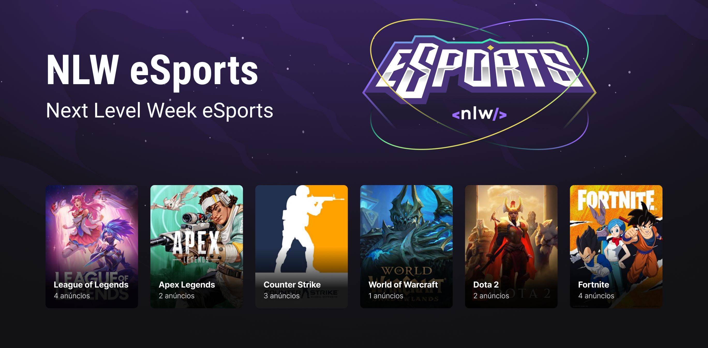

<h1 align="center">eSports</h1>

  

    </img>

 

## 💻 Projeto

O <b>eSports</b> e um projeto multiplataforma que disponibiliza meios para os players jogarem juntos, foi desenvolvido durante a semana do [NLW-eSports](https://github.com/rocketseat-education) com base neste [protótipo](https://www.figma.com/file/GA28J5IkFOqDd3IGpqgqnK/NLW-eSports).

## ✨ Tecnologias

Este projeto foi desenvolvido com as seguintes tecnologias:

> Api
- [NodeJS](https://nodejs.org/en/)
- [TypeScript](https://www.typescriptlang.org/)
- [Express](https://expressjs.com/)
- [Prisma](https://www.prisma.io/)
- [Cors](https://github.com/expressjs/cors)
>Web
- [NodeJS](https://nodejs.org/en/)
- [TypeScript](https://www.typescriptlang.org/)
- [React](https://reactjs.org/)
- [Axios](https://axios-http.com/)
- [Tailwind ](https://tailwindcss.com/)
- [Radix](https://www.radix-ui.com/)
>Mobile
- [NodeJS](https://nodejs.org/en/)
- [TypeScript](https://www.typescriptlang.org/)
- [React Native](https://reactnative.dev/)
- [Expo](https://expo.dev/)

## 🚀 Como executar

- Clone o repositório
>Api
- Rode `cd server` para ir até a pasta da api
- Rode `npm install` para instalar as dependências
- Rode o `npm run dev` para iniciar a aplicação na porta <b>3333</b>
- Por fim, a <b>API</b> estará disponível em `http://localhost:3333`
>Web
- Rode `cd web` para ir até a pasta web
- Rode `npm install` para instalar as dependências
- Rode o `npm run dev` para iniciar a aplicação na porta <b>3000</b>
- Por fim, o <b>Website</b> estará disponível em `http://localhost:3000`
>Mobile
#### ***Obs: tenha o expo [instalado](https://docs.expo.dev/) na sua maquina**
- Rode `cd mobile` para ir até a pasta mobile
- Rode `npx expo install` para instalar as dependências
- Rode o `npx expo ` para iniciar a aplicação
- Por fim, o <b>Bundler do APP</b> estará disponível

## 📄 Licença

Esse projeto está sob a licença MIT. Veja o arquivo [LICENSE](LICENSE) para mais detalhes.
