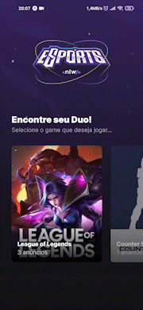

<h1 align="center">eSports(mobile)</h1>

  

<!-- 

    </img>
    </img> 
    </img>

 -->

 

  |                                      Android                                       |                                      IOS                                      |
  | :--------------------------------------------------------------------------------: | :---------------------------------------------------------------------------: |
  | </img> | </img> |

 

## 💻 Projeto

O <b>eSports</b> e um projeto multiplataforma que disponibiliza meios para os players jogarem juntos, foi desenvolvido durante a semana do [NLW-eSports](https://github.com/rocketseat-education) com base neste [protótipo](https://www.figma.com/file/GA28J5IkFOqDd3IGpqgqnK/NLW-eSports).

## ✨ Tecnologias

Este projeto foi desenvolvido com as seguintes tecnologias:

- [NodeJS](https://nodejs.org/en/)
- [TypeScript](https://www.typescriptlang.org/)
- [React Native](https://reactnative.dev/)
- [Expo](https://expo.dev/)

## 🚀 Como executar

#### ***Obs: Tenha o expo [instalado](https://docs.expo.dev/) na sua maquina**
#### ***Obs: Execute a [API](../server/) antes**
- Rode `cd mobile` para ir até a pasta mobile
- Rode `npx expo install` para instalar as dependências
- Rode o `npx expo ` para iniciar a aplicação
- Por fim, o <b>Bundler do APP</b> estará disponível

## 📄 Licença

Esse projeto está sob a licença MIT. Veja o arquivo [LICENSE](../LICENSE) para mais detalhes.
