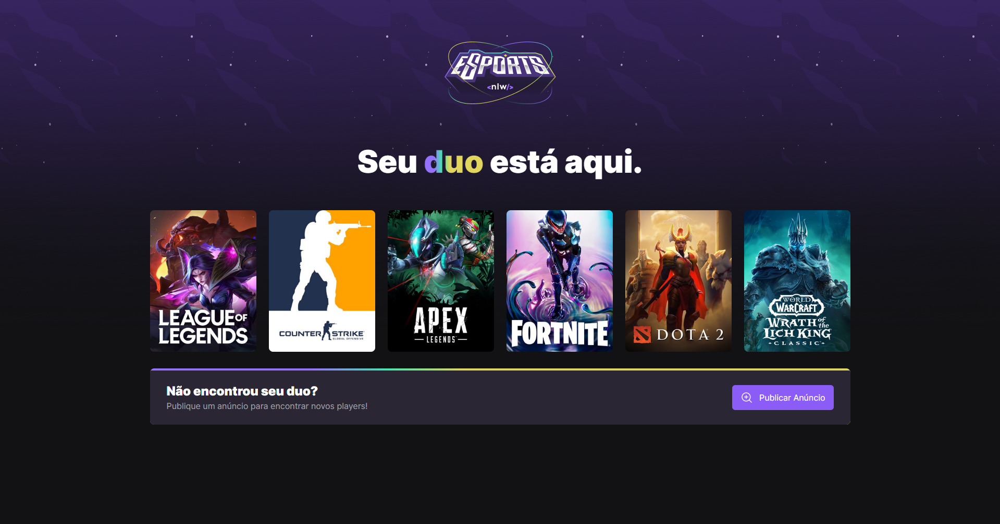
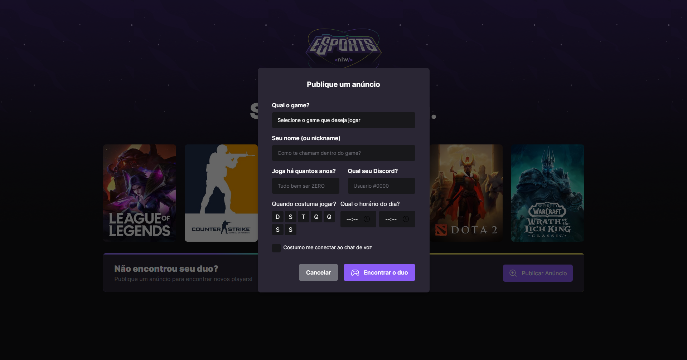
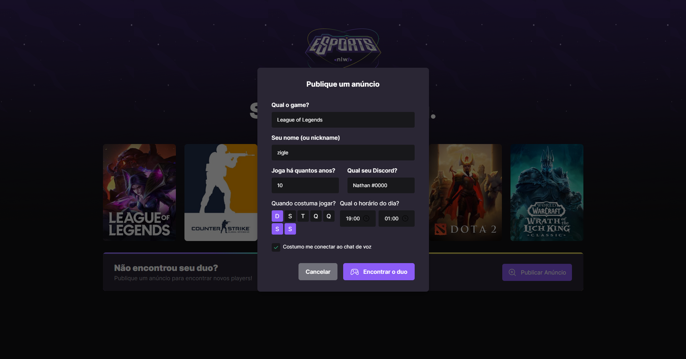
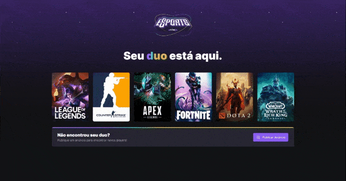

<h1 align="center">eSports(web)</h1>

  

    <!--  -->
    </img>
    </img> 
    </img>
    </img> 

 

## 💻 Projeto

O <b>eSports</b> e um projeto multiplataforma que disponibiliza meios para os players jogarem juntos, foi desenvolvido durante a semana do [NLW-eSports](https://github.com/rocketseat-education) com base neste [protótipo](https://www.figma.com/file/GA28J5IkFOqDd3IGpqgqnK/NLW-eSports).

## ✨ Tecnologias

Este projeto foi desenvolvido com as seguintes tecnologias:

- [NodeJS](https://nodejs.org/en/)
- [TypeScript](https://www.typescriptlang.org/)
- [React](https://reactjs.org/)
- [Axios](https://axios-http.com/)
- [Tailwind ](https://tailwindcss.com/)
- [Radix](https://www.radix-ui.com/)

## 🚀 Como executar

- Clone o repositório
- Execute `cd web` no terminal para ir até a pasta web
- Execute `npm install` para instalar as dependências
- Execute a [API](../server/)
- Execute o `npm run dev` para iniciar a aplicação na porta <b>3000</b>
- Por fim, o <b>Website</b> estará disponível em `http://localhost:3000`

## 📄 Licença

Esse projeto está sob a licença MIT. Veja o arquivo [LICENSE](../LICENSE) para mais detalhes.
